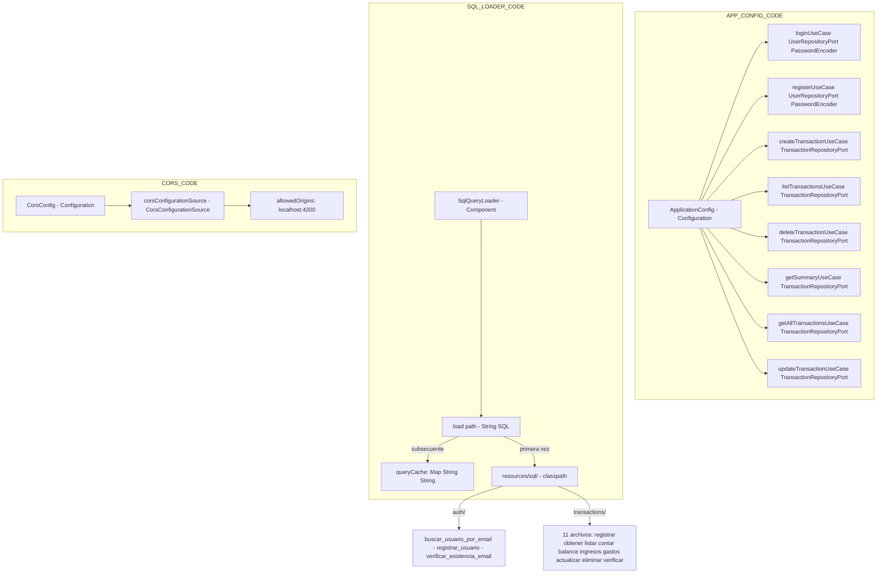

# Diagramas de Arquitectura — Finanzas Personales Backend

---

## 1. Diagrama de Componentes

```mermaid
graph TD
    %% Actores externos
    ANGULAR[Frontend Angular 21]
    PG[(PostgreSQL R2DBC)]

    %% Componente: Health
    subgraph HEALTH
        HEALTH_CTRL[HealthController]
        HEALTH_DTO[HealthResponse]
    end

    %% Componente: Security
    subgraph SECURITY
        SEC_CFG[SecurityConfig]
        JWT_FILTER[JwtAuthFilter - WebFilter]
        JWT_SVC[JwtService]
        PWD_ENC[PasswordEncoder BCrypt]
    end

    %% Componente: Config
    subgraph CONFIG
        APP_CFG[ApplicationConfig - Bean Factory]
        CORS_CFG[CorsConfig]
        SQL_LOADER[SqlQueryLoader - Cache SQL]
    end

    %% Componente: Auth - Adapter In
    subgraph AUTH_IN
        AUTH_CTRL[AuthController]
        LOGIN_REQ[LoginRequest DTO]
        REG_REQ[RegisterRequest DTO]
        USER_RESP[UserResponse DTO]
    end

    %% Componente: Auth - Domain
    subgraph AUTH_DOMAIN
        LOGIN_UC[LoginUseCase]
        REG_UC[RegisterUseCase]
        USER_MODEL[User - Domain Model]
        USER_ROLE[UserRole Enum]
        USER_PORT[UserRepositoryPort]
    end

    %% Componente: Auth - Adapter Out
    subgraph AUTH_OUT
        R2DBC_USER[R2dbcUserAdapter]
        USER_ENTITY[UserEntity]
    end

    %% Componente: Transactions - Adapter In
    subgraph TX_IN
        TX_CTRL[TransactionController]
        TX_REQ[TransactionRequest DTO]
        TX_RESP[TransactionResponse DTO]
        TX_PAGE[TransactionPageResponse DTO]
        TX_SUMMARY_DTO[TransactionSummaryResponse DTO]
    end

    %% Componente: Transactions - Domain
    subgraph TX_DOMAIN
        CREATE_UC[CreateTransactionUseCase]
        UPDATE_UC[UpdateTransactionUseCase]
        LIST_UC[ListTransactionsUseCase]
        DELETE_UC[DeleteTransactionUseCase]
        SUMMARY_UC[GetSummaryUseCase]
        GETALL_UC[GetAllTransactionsUseCase]
        TX_MODEL[TransactionsDto - Domain Model]
        TX_CAT[TransactionCategory Enum]
        TX_TYPE[TransactionType Enum]
        TX_PORT[TransactionRepositoryPort]
    end

    %% Componente: Transactions - Adapter Out
    subgraph TX_OUT
        R2DBC_TX[R2dbcTransactionAdapter]
        TX_ENTITY[TransactionEntity]
        CAT_ENTITY[CategoryEntity]
        TYPE_ENTITY[TransactionTypeEntity]
    end

    %% Flujo HTTP del Frontend
    ANGULAR -->|POST /api/auth/login, register| AUTH_CTRL
    ANGULAR -->|GET /api/health| HEALTH_CTRL
    ANGULAR -->|CRUD /api/transactions| TX_CTRL

    %% Security intercepta todo
    ANGULAR -->|Bearer JWT| JWT_FILTER
    JWT_FILTER -->|valida token| JWT_SVC
    SEC_CFG -->|registra filtro| JWT_FILTER

    %% Auth Controller hacia Domain
    AUTH_CTRL -->|delega| LOGIN_UC
    AUTH_CTRL -->|delega| REG_UC
    AUTH_CTRL -->|genera JWT| JWT_SVC

    %% Auth Domain hacia Port
    LOGIN_UC -->|consulta| USER_PORT
    LOGIN_UC -->|verifica password| PWD_ENC
    REG_UC -->|persiste| USER_PORT
    REG_UC -->|hashea password| PWD_ENC

    %% Auth Adapter Out implementa Port
    R2DBC_USER -.->|implements| USER_PORT
    R2DBC_USER -->|carga queries| SQL_LOADER
    R2DBC_USER -->|mapea| USER_ENTITY
    R2DBC_USER -->|R2DBC| PG

    %% Transaction Controller hacia Domain
    TX_CTRL -->|delega| CREATE_UC
    TX_CTRL -->|delega| UPDATE_UC
    TX_CTRL -->|delega| LIST_UC
    TX_CTRL -->|delega| DELETE_UC
    TX_CTRL -->|delega| SUMMARY_UC
    TX_CTRL -->|delega| GETALL_UC

    %% Transaction Domain hacia Port
    CREATE_UC -->|persiste| TX_PORT
    UPDATE_UC -->|actualiza| TX_PORT
    LIST_UC -->|consulta paginada| TX_PORT
    DELETE_UC -->|elimina| TX_PORT
    SUMMARY_UC -->|agrega| TX_PORT
    GETALL_UC -->|consulta| TX_PORT

    %% Transaction Adapter Out implementa Port
    R2DBC_TX -.->|implements| TX_PORT
    R2DBC_TX -->|carga queries| SQL_LOADER
    R2DBC_TX -->|mapea| TX_ENTITY
    R2DBC_TX -->|R2DBC| PG

    %% ApplicationConfig registra beans del dominio
    APP_CFG -.->|crea bean| LOGIN_UC
    APP_CFG -.->|crea bean| REG_UC
    APP_CFG -.->|crea bean| CREATE_UC
    APP_CFG -.->|crea bean| UPDATE_UC
    APP_CFG -.->|crea bean| LIST_UC
    APP_CFG -.->|crea bean| DELETE_UC
    APP_CFG -.->|crea bean| SUMMARY_UC
    APP_CFG -.->|crea bean| GETALL_UC

    %% SQL Loader carga archivos
    SQL_LOADER -->|lee classpath| SQL_FILES[resources/sql/*.sql]
```

---

## 2. Diagrama C4 Nivel 4 — Codigo

### 2.1 Modulo Auth - Nivel Codigo

```mermaid
graph TD
    %% Interfaces y Clases del modulo Auth

    %% Port
    subgraph PORT_AUTH
        URP[UserRepositoryPort - interface]
        URP_M1[findByEmail - Mono User]
        URP_M2[save - Mono User]
        URP_M3[existsByEmail - Mono Boolean]
    end

    %% Domain Model
    subgraph MODEL_AUTH
        USER_CLS[User - Data Builder]
        USER_F1[id: String]
        USER_F2[email: String]
        USER_F3[password: String]
        USER_F4[name: String]
        USER_F5[role: UserRole]
        ROLE_ENUM[UserRole - ADMIN USER]
    end

    %% Use Cases
    subgraph USECASE_AUTH
        LOGIN[LoginUseCase]
        LOGIN_F1[userRepositoryPort: UserRepositoryPort]
        LOGIN_F2[passwordEncoder: PasswordEncoder]
        LOGIN_M1[execute email password - Mono User]

        REG[RegisterUseCase]
        REG_F1[userRepositoryPort: UserRepositoryPort]
        REG_F2[passwordEncoder: PasswordEncoder]
        REG_M1[execute email password name - Mono User]

        UNAUTH[UnauthorizedException]
        EMAIL_EX[EmailAlreadyExistsException]
    end

    %% Adapter In
    subgraph ADAPTER_IN_AUTH
        CTRL[AuthController - RestController]
        CTRL_F1[loginUseCase: LoginUseCase]
        CTRL_F2[registerUseCase: RegisterUseCase]
        CTRL_F3[jwtService: JwtService]
        CTRL_M1[POST /api/auth/login - Mono ResponseEntity]
        CTRL_M2[POST /api/auth/register - Mono ResponseEntity]
    end

    %% DTOs
    subgraph DTO_AUTH
        L_REQ[LoginRequest - Valid]
        L_REQ_F1[email: String NotBlank]
        L_REQ_F2[password: String NotBlank]

        R_REQ[RegisterRequest - Valid]
        R_REQ_F1[email: String NotBlank]
        R_REQ_F2[password: String NotBlank]
        R_REQ_F3[name: String NotBlank]

        U_RESP[UserResponse]
        U_RESP_F1[id email name role token]
        U_RESP_M1[from User token - UserResponse]
    end

    %% Adapter Out
    subgraph ADAPTER_OUT_AUTH
        R2DBC[R2dbcUserAdapter - Component]
        R2DBC_F1[databaseClient: DatabaseClient]
        R2DBC_F2[sqlQueryLoader: SqlQueryLoader]
        R2DBC_M1[findByEmail - query auth/buscar_usuario_por_email]
        R2DBC_M2[save - query auth/registrar_usuario]
        R2DBC_M3[existsByEmail - query auth/verificar_existencia_email]
    end

    %% Entity
    subgraph ENTITY_AUTH
        U_ENT[UserEntity - Table users]
        U_ENT_F1[id email passwordHash name role createdAt]
    end

    %% Relaciones - Adapter In usa Use Cases
    CTRL -->|inyecta| LOGIN
    CTRL -->|inyecta| REG
    CTRL -->|recibe| L_REQ
    CTRL -->|recibe| R_REQ
    CTRL -->|retorna| U_RESP

    %% Use Cases dependen de Port
    LOGIN -->|depende| URP
    LOGIN -.->|lanza| UNAUTH
    REG -->|depende| URP
    REG -.->|lanza| EMAIL_EX

    %% Use Cases usan Model
    LOGIN -->|retorna| USER_CLS
    REG -->|crea y retorna| USER_CLS
    USER_CLS -->|contiene| ROLE_ENUM

    %% Port metodos
    URP --> URP_M1
    URP --> URP_M2
    URP --> URP_M3

    %% Adapter Out implementa Port
    R2DBC -.->|implements| URP
    R2DBC -->|mapea desde| U_ENT
    R2DBC -->|ejecuta SQL| R2DBC_M1
    R2DBC -->|ejecuta SQL| R2DBC_M2
    R2DBC -->|ejecuta SQL| R2DBC_M3
```

### 2.2 Modulo Transactions - Nivel Codigo

```mermaid
graph TD
    %% Port
    subgraph PORT_TX
        TRP[TransactionRepositoryPort - interface]
        TRP_M1[save - Mono TransactionsDto]
        TRP_M2[findById - Mono TransactionsDto]
        TRP_M3[findAllByUserId - Flux TransactionsDto]
        TRP_M4[findByUserIdPaginated - Flux TransactionsDto]
        TRP_M5[countByUserIdFiltered - Mono Long]
        TRP_M6[getTotalBalance - Mono BigDecimal]
        TRP_M7[getMonthlyIncome - Mono BigDecimal]
        TRP_M8[getMonthlyExpenses - Mono BigDecimal]
        TRP_M9[deleteByIdAndUserId - Mono Long]
        TRP_M10[existsById - Mono Boolean]
        TRP_M11[update - Mono TransactionsDto]
    end

    %% Domain Model
    subgraph MODEL_TX
        TX_DTO[TransactionsDto - Domain Model]
        TX_F1[id: String]
        TX_F2[userId: String]
        TX_F3[description: String]
        TX_F4[amount: BigDecimal]
        TX_F5[category: TransactionCategory]
        TX_F6[type: TransactionType]
        TX_F7[transactionDate: LocalDate]
        TX_F8[notes: String]
        TX_F9[createdAt: LocalDateTime]

        CAT_ENUM[TransactionCategory - 12 valores]
        TYPE_ENUM[TransactionType - INCOME EXPENSE]
    end

    %% Use Cases
    subgraph USECASE_TX
        C_UC[CreateTransactionUseCase]
        C_UC_M[execute userId desc amount cat type date notes]

        U_UC[UpdateTransactionUseCase]
        U_UC_M[execute txId userId desc amount cat type date notes]

        L_UC[ListTransactionsUseCase]
        L_UC_M[execute userId from to type category page size]

        D_UC[DeleteTransactionUseCase]
        D_UC_M[execute txId userId]

        S_UC[GetSummaryUseCase]
        S_UC_M[execute userId month year]

        GA_UC[GetAllTransactionsUseCase]
        GA_UC_M[execute userId - Flux TransactionsDto]
    end

    %% Adapter In
    subgraph ADAPTER_IN_TX
        TX_CTRL[TransactionController - RestController]
        TX_CTRL_M1[GET /api/transactions - paginado filtros]
        TX_CTRL_M2[GET /api/transactions/all]
        TX_CTRL_M3[GET /api/transactions/summary]
        TX_CTRL_M4[POST /api/transactions]
        TX_CTRL_M5[PUT /api/transactions/id]
        TX_CTRL_M6[DELETE /api/transactions/id]
    end

    %% DTOs
    subgraph DTO_TX
        TX_REQ[TransactionRequest - Valid]
        TX_REQ_F[description amount category type transactionDate notes]

        TX_RESP[TransactionResponse - JsonProperty date]
        TX_RESP_F[id description amount category type date notes createdAt]

        TX_PAGE[TransactionPageResponse - Generic T]
        TX_PAGE_F[content totalElements totalPages page size]

        TX_SUMM[TransactionSummaryResponse]
        TX_SUMM_F[totalBalance monthlyIncome monthlyExpenses monthlySavings savingsGoal]
    end

    %% Adapter Out
    subgraph ADAPTER_OUT_TX
        R2DBC_TX[R2dbcTransactionAdapter - Component]
        R2DBC_TX_F1[databaseClient: DatabaseClient]
        R2DBC_TX_F2[sqlQueryLoader: SqlQueryLoader]
        R2DBC_TX_Q1[transactions/registrar_transaccion]
        R2DBC_TX_Q2[transactions/listar_transacciones_paginadas]
        R2DBC_TX_Q3[transactions/contar_transacciones_filtradas]
        R2DBC_TX_Q4[transactions/obtener_balance_total]
        R2DBC_TX_Q5[transactions/obtener_ingresos_mensuales]
        R2DBC_TX_Q6[transactions/obtener_gastos_mensuales]
        R2DBC_TX_Q7[transactions/actualizar_transaccion]
        R2DBC_TX_Q8[transactions/eliminar_transaccion_por_id_y_usuario]
    end

    %% Entity
    subgraph ENTITY_TX
        TX_ENT[TransactionEntity - Table transactions]
        CAT_ENT[CategoryEntity - Table categories]
        TYPE_ENT[TransactionTypeEntity - Table transaction_types]
    end

    %% Controller -> Use Cases
    TX_CTRL -->|inyecta| C_UC
    TX_CTRL -->|inyecta| U_UC
    TX_CTRL -->|inyecta| L_UC
    TX_CTRL -->|inyecta| D_UC
    TX_CTRL -->|inyecta| S_UC
    TX_CTRL -->|inyecta| GA_UC

    %% Controller usa DTOs
    TX_CTRL -->|recibe| TX_REQ
    TX_CTRL -->|retorna| TX_RESP
    TX_CTRL -->|retorna| TX_PAGE
    TX_CTRL -->|retorna| TX_SUMM

    %% Use Cases dependen del Port
    C_UC -->|depende| TRP
    U_UC -->|depende| TRP
    L_UC -->|depende| TRP
    D_UC -->|depende| TRP
    S_UC -->|depende| TRP
    GA_UC -->|depende| TRP

    %% Use Cases usan Domain Model
    C_UC -->|crea| TX_DTO
    U_UC -->|actualiza| TX_DTO
    L_UC -->|retorna| TX_DTO
    TX_DTO --> CAT_ENUM
    TX_DTO --> TYPE_ENUM

    %% Adapter Out implementa Port
    R2DBC_TX -.->|implements| TRP
    R2DBC_TX -->|mapea| TX_ENT
    R2DBC_TX -->|referencia| CAT_ENT
    R2DBC_TX -->|referencia| TYPE_ENT

    %% Port -> metodos
    TRP --> TRP_M1
    TRP --> TRP_M2
    TRP --> TRP_M4
    TRP --> TRP_M6
    TRP --> TRP_M9
```

### 2.3 Modulo Security - Nivel Codigo

```mermaid
graph TD
    %% Security classes
    subgraph SECURITY_CODE
        JWT_SVC[JwtService - Service]
        JWT_M1[generateToken User - String JWT]
        JWT_M2[extractClaims token - Claims]
        JWT_M3[isTokenValid token - boolean]
        JWT_M4[extractEmail token - String]
        JWT_M5[extractId token - String userId]
        JWT_M6[extractRole token - String role]
        JWT_F1[secret: String from properties]
        JWT_F2[expirationMs: long 86400000]
    end

    subgraph FILTER_CODE
        JWT_FILTER[JwtAuthFilter - WebFilter Component]
        FILTER_M1[filter exchange chain - Mono Void]
        FILTER_F1[jwtService: JwtService]
    end

    subgraph SEC_CONFIG_CODE
        SEC_CFG[SecurityConfig - Configuration]
        SEC_M1[securityWebFilterChain - SecurityWebFilterChain]
        SEC_M2[passwordEncoder - PasswordEncoder BCrypt]
        SEC_RULES1[permitAll: /api/auth/* /api/health /swagger-ui/**]
        SEC_RULES2[authenticated: anyExchange]
    end

    %% JWT Payload
    subgraph JWT_PAYLOAD
        CLAIMS[JWT Claims]
        CL_SUB[sub: email]
        CL_ID[id: userId UUID]
        CL_NAME[name: nombre]
        CL_ROLE[role: ADMIN o USER]
        CL_EXP[exp: 24h desde emision]
    end

    %% Flujo de autenticacion
    REQUEST[HTTP Request con Bearer token] -->|header Authorization| JWT_FILTER
    JWT_FILTER -->|extrae token| JWT_SVC
    JWT_SVC -->|parsea| CLAIMS
    JWT_FILTER -->|establece| AUTH_TOKEN[UsernamePasswordAuthenticationToken]
    AUTH_TOKEN -->|principal| PRINCIPAL[userId - String]
    AUTH_TOKEN -->|credentials| CREDS[email - String]
    AUTH_TOKEN -->|authorities| ROLE_AUTH[ROLE_ADMIN o ROLE_USER]
    AUTH_TOKEN -->|contextWrite| SEC_CONTEXT[ReactiveSecurityContextHolder]

    %% Config registra filtro
    SEC_CFG -->|addFilterBefore AUTHENTICATION| JWT_FILTER
    SEC_CFG -->|define rutas publicas| SEC_RULES1
    SEC_CFG -->|define rutas protegidas| SEC_RULES2

    %% JwtService metodos
    JWT_SVC --> JWT_M1
    JWT_SVC --> JWT_M2
    JWT_SVC --> JWT_M3
    JWT_SVC --> JWT_M4
    JWT_SVC --> JWT_M5
    JWT_SVC --> JWT_M6

    %% Claims contenido
    CLAIMS --> CL_SUB
    CLAIMS --> CL_ID
    CLAIMS --> CL_NAME
    CLAIMS --> CL_ROLE
    CLAIMS --> CL_EXP
```

### 2.4 Modulo Config - Nivel Codigo

